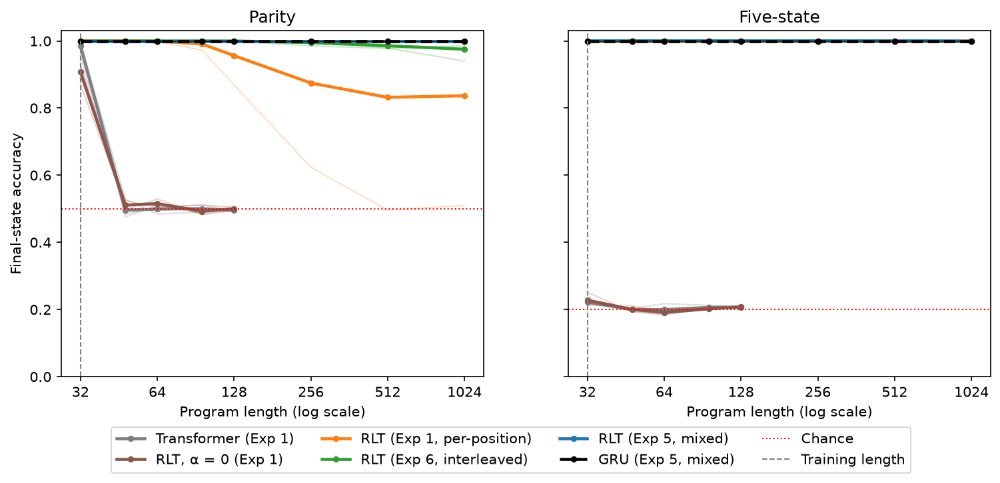

# When Does a Recurrent Looped Transformer Learn Its Recurrence?

*An independent implementation and six length-generalization experiments*

**[Your name]** · October 2026 · Code and full results: this repository

## Abstract

The Recurrent Looped Transformer (RLT) feeds each token's final decoder state back into the next token's decoder input, giving a transformer a recurrent state that persists across the sequence. We implement RLT from its technical report alone, verify it against the report's formal properties, and study length generalization on two state-tracking tasks, parity and a five-state permutation automaton, with roughly 59K-parameter models trained at length 32. With per-position supervision, RLT generalizes to 4× its training length while a parameter-matched transformer and RLT with its feedback removed fall to chance. With final-answer-only supervision, the outcome depends on the length schedule. Under a short-to-long curriculum, RLT solves each short stage through attention rather than recurrence and then collapses to a constant prediction, while a GRU learns the task perfectly. Checkpoint ablations confirm the diagnosis, and its prediction holds: when long programs appear frequently, either mixed into every step or interleaved one length per step, RLT learns a solution that depends entirely on its recurrence and holds 100% accuracy to 32× the training length.

## 1. Introduction

RLT (Zhang, Feng & Qin, 2026) adds a recurrent path to an encoder–decoder transformer. A causal encoder produces token representations and a global key–value memory; a decoder with sliding-window attention reads that memory, and a gated merge feeds the decoder's previous output back into its next input. The computation path therefore grows with sequence length while the work per token stays fixed. The report specifies the architecture and proves several of its properties; its project page has since added experiments at much larger scale.

We set out to replicate the architecture independently and test whether its recurrence delivers length generalization on tasks that require tracking state. The main result turned out to be about learning rather than capacity: RLT can represent the recurrent solution easily, but whether training finds it depends on what the model sees early on. Because RLT also has attention paths that can solve short programs without recurrence, it can learn the wrong solution and become trapped.

Our contributions are:

- A from-scratch implementation verified against the report's serving-split invariance (Proposition 3.1), full-state causality (Proposition B.1), and two-gradient-path analysis, with bit-for-bit reproducible training.
- A controlled comparison against RLT with α = 0, a transformer, and a GRU, all parameter-matched.
- Evidence, from stage-end checkpoint ablations, that RLT's failure under a curriculum comes from an attention shortcut, not from instability in its feedback loop.
- A prediction from that diagnosis, tested and confirmed, plus a control that narrows what prevents the failure.

## 2. Implementation and verification

The model follows the report's specification: a causal encoder with RoPE at explicit absolute positions; encoder-derived memory restricted to the current prefix; a gated merge, `u_t = e_t + α · g_t ⊙ W_s · RMSNorm(s_{t−1})`; and a decoder whose state is the pair of its output and its per-layer sliding-window caches, initialized from a learned state `s*`. The decoder runs strictly sequentially, and training uses full backpropagation through time.

Every component was written test-first. The suite, 392 tests in its final form, includes:

- **Serving-split invariance (Proposition 3.1).** Prefilling a prompt and then stepping token by token yields identical states and logits at every split point, at all 11 splits across 8 configurations, to `1e-12`.
- **Causality (Proposition B.1).** Changing token *j* leaves the full state at every earlier position bit-identical.
- **Two gradient paths.** With window size above 1, gradient reaches `s*` through both the recurrent state and the window cache. Detaching either path alone leaves a gradient; detaching both removes it. With window size 1, detaching the state cuts the only path.
- **Finite differences.** Autograd gradients match central differences to `rtol = 1e-6`.

Training is deterministic on one CPU thread, and reruns reproduce earlier loss histories exactly across commits (Section 4.4).

## 3. Experimental setup

**Tasks.** Each program is a sequence of binary operations, and the model tracks a hidden state. In **parity**, operation 1 flips a bit and operation 0 keeps it, so the state is the running parity and the order of operations does not matter. In **five-state**, operation 0 swaps states 0 and 1 and operation 1 rotates all five states by one. Order matters, and the two operations together generate every permutation of the five states (the group S5). Chance accuracy is 50% for parity and 20% for five-state.

**Models.** RLT with width 32, 2 encoder and 2 decoder layers, window 3, one memory group, and α = 0.5 (59,040 parameters on parity). Baselines are parameter-matched within 5%: RLT with α = 0 (identical, with feedback off), a 3-layer transformer of width 40, and a 1-layer GRU of width 98.

**Training.** AdamW with learning rate 0.003 decaying to 0.0003 on a cosine schedule, 200 warmup steps, weight decay 0.01, gradient clipping at 1.0, batch size 64, and fresh programs every step. The training length is 32. Unless noted, runs take 3,000 steps. Seeds 0, 1, and 2.

**Objective.** We train on the task's state labels rather than the report's next-token objective, because in these tasks the next input token is random and next-token loss cannot distinguish architectures. *Per-position* supervision scores the state after every operation; *final-only* supervision scores only the state after the last one.

**Evaluation.** Final-state accuracy on the same held-out programs for every model: 2,048 programs per length at 32, 48, 64, 96, and 128, and 1,024 programs per length at 256, 512, and 1,024, evaluated from saved checkpoints.

## 4. Results

### 4.1 With dense labels, recurrence generalizes (Experiment 1)

**Figure 1.** Final-state accuracy versus program length, for models trained at length 32 (dashed vertical line). Thick lines are means over 3 seeds; thin lines are individual seeds. On parity, Experiment 1's RLT average (orange) hides a split: two seeds stay at 100% while one falls to chance by length 512. On five-state, all RLT variants and the GRU overlap at 100%. The transformer and α = 0 were not evaluated past length 128.

With per-position supervision at fixed length 32, RLT reaches 95.6% on parity and 100% on five-state at length 128. The comparison that isolates the recurrence is α = 0, the same model with feedback switched off: it falls to chance on parity as soon as programs exceed the training length, and is at chance on five-state even at length 32. The transformer fits parity at the training length (98.5%) but drops to chance at 48, and never learns five-state, consistent with the expected difficulty of the S5 word problem for fixed-depth transformers. The GRU is at 100% throughout.

Figure 1 also shows that RLT's parity average conceals a split. Two seeds learned the exact rule and hold 100% to length 1,024; the third learned an approximation that is already at 87.6% at length 128 and reaches chance by 512.

### 4.2 Final-answer supervision fails at this budget (Experiment 2)

With only the final state supervised, both RLT and the GRU end at chance on both tasks, even at the training length, with training loss at chance throughout. A positive control rules out a broken training path: at length 4, both models learn final-only parity to 100%. Length 32 is simply too hard to learn from a single label per program at this budget, since the final label carries almost no information until the computation is nearly right.

The control also contained an early hint. Trained final-only at length 4, the GRU generalized to length 8 at 100%, correct at every intermediate position despite never being told those answers. RLT reached only 74.6% at length 8.

### 4.3 A curriculum works for the GRU, not RLT (Experiment 3)

We trained final-only with a curriculum of four 1,500-step stages at lengths 4, 8, 16, and 32 (6,000 steps). The GRU learned both tasks perfectly, generalizing to 100% at length 128. RLT ended at chance on both.

RLT's training history shows a consistent pattern. On parity, every seed solved length 4 within about 170 steps. At the switch to length 8, the gradient norm spiked to between 17 and 69 (against a clip limit of 1), the decoder state norm grew roughly tenfold, and the loss settled at chance, where it stayed with gradient norms near 1.5 for the rest of training. On five-state, RLT solved lengths 4 and 8, then collapsed the same way at 16.

Two facts suggested a shortcut. First, length 4 does not require recurrence: RLT with α = 0, trained final-only at length 4, reaches 100% there and 48% at length 8. Cross-attention to the encoder memory sees the whole prefix, and with 2 decoder layers and window 3 the window caches alone reach back 4 positions, covering an entire length-4 program. Second, cutting the feedback of the Experiment 2 control model at test time reduced its length-4 accuracy from 100% to 72.3%, so that model used its recurrence partly but not entirely.

### 4.4 Diagnosis: a shortcut, not instability (Experiment 4)

To distinguish a shortcut from instability in the feedback loop, we reran the curriculum with checkpoints at the end of every stage, at α = 0.5 and at α = 0.1, the feedback scale the authors use.

**Reproducibility.** All six α = 0.5 runs reproduce Experiment 3's 6,000-step loss histories bit for bit, despite a different commit, evaluation schedule, and checkpoint code.

**Weaker feedback does not help.** α = 0.1 collapses with the same signature as α = 0.5.

**The collapse is a constant answer.** On parity, each collapsed run's accuracy at length 32 equals exactly the share of test programs ending in one class, 50.63% or 49.37%.

**Before each collapse, RLT was not using its recurrence.** Table 1 evaluates the stage-end checkpoint just before each collapse, as trained and with the feedback cut.

**Table 1.** Accuracy at the current stage length, at the checkpoint before the collapse.

| Task, checkpoint | Arm | Feedback on | Feedback cut |
| --- | --- | --- | --- |
| Parity, step 1,500 (length 4) | α = 0.5, seeds 0, 1 | 100% | 100% |
| | α = 0.5, seed 2 | 100% | 69.7% |
| | α = 0.1, all seeds | 100% | 100% |
| Five-state, step 3,000 (length 8) | α = 0.5, all seeds | 100% | 92.8–94.9% |
| | α = 0.1, all seeds | 100% | 99.0–100% |

In five of six parity runs, removing the feedback changed nothing: RLT was solving length 4 without its recurrence. Those solutions did not extend, scoring 37–67% at length 8 before any training on it, and five-state's scored 20–24% at length 16. At α = 0.1, RLT relied on its recurrence even less.

The state-norm growth is most likely a symptom of the collapse rather than its cause. It occurs at both α values and in models not using their feedback, and the feedback passes through an RMSNorm before the merge, which removes its scale.

The diagnosis is therefore that when only short programs are available, RLT's attention paths solve them, the recurrence is never learned, and when the length increases the attention solution breaks, leaving the model to collapse to a constant answer from which it does not escape. The GRU, which has no attention, has no such shortcut.

### 4.5 The prediction: mixed lengths prevent the collapse (Experiment 5)

If the shortcut explanation is right, training in which long programs are always present should prevent the collapse, because no shortcut can then reduce the loss on its own. We split each batch of 64 into four groups of 16 at lengths 4, 8, 16, and 32, ran each group separately, and took one optimizer step on the mean loss. Everything else matched Experiment 2, including its 192,000 training programs, half as many as the curriculum.

The prediction held. RLT reached 100% at every length from 32 to 128 on both tasks, on every seed, from final answers alone, and held 100% to length 1,024 (32× training), with one five-state seed at 99.9%. Cutting its feedback now drops it to chance on every seed, about 50% on parity and 20% on five-state at both lengths 32 and 128. This is the reverse of Experiment 4: the same architecture, lengths, and objective, but now the model depends entirely on its recurrence.

### 4.6 Control: frequent long programs suffice (Experiment 6)

Mixing changed two things at once: lengths shared each gradient step, and long programs appeared constantly. To separate them, we interleaved lengths instead, giving each step a single length and cycling 4, 8, 16, 32. This matches Experiment 5's exposure exactly, 48,000 programs per length, without ever mixing lengths within a step.

Interleaving also prevents the collapse. RLT reached 100% from 32 to 96 on both tasks and 99.98% on parity at 128, and cutting its feedback again drops it to chance. At extreme lengths a small difference appears: on parity at length 1,024, the three seeds score 100%, 98.6%, and 94.0%, against 100% for all three under mixing. With three seeds, this suggests that within-step mixing may help slightly at extreme lengths, but does not establish it.

**Table 2.** Summary. Final-state accuracy at length 128, mean over 3 seeds, parity / five-state.

| Experiment | Supervision | Training lengths | RLT | GRU |
| --- | --- | --- | --- | --- |
| 1 | Every position | Fixed 32 | 95.6% / 100% | 100% / 100% |
| 2 | Final only | Fixed 32 | 50.1% / 19.7% | 50.0% / 20.1% |
| 3 | Final only | Curriculum 4 → 32 | 49.9% / 19.8% | 100% / 100% |
| 5 | Final only | Mixed 4–32 in every step | 100% / 100% | 100% / 100% |
| 6 | Final only | Interleaved 4–32 | 99.98% / 100% | 100% / 100% |

## 5. Discussion

**Attention and recurrence compete.** RLT's extra pathways are usually described as capacity: the encoder memory and window caches give the decoder rich context. Our results show they also give the optimizer an alternative. When short programs alone are on offer, attention solves them faster than the recurrence can be learned, and gradient descent takes that route. The recurrent solution, which is the one that extrapolates, only wins when it is the only thing that works on the data being seen. A GRU has no alternative and learns the recurrence whenever the signal is strong enough. The failure is specific, and the fix is simple: long programs must appear often.

**Relation to the authors' experiments.** The authors' larger-scale results agree with ours where they overlap: their best splits hold 100% on parity at 256 bits while a transformer is near chance. Several of their choices are consistent with our findings. In their sixteen-layer runs they train parity on mixed lengths from 3 to 40, which by our results prevents the shortcut from taking over. They select the checkpoint with the lowest in-distribution validation loss, which would hide a collapse like the one in Experiment 3. They use α = 0.1, which in our setting neither caused nor prevented the collapse. Their models are about 450 times larger than ours, so whether the shortcut dynamic matters at their scale is an open question.

**The community proof-of-concept.** An independent community experiment on the authors' project page reported RLT at 60.8% on parity and 20.7% on five-state at length 128, far below our Experiment 1. Its training setup is only partly documented, so we cannot identify the cause. Our results suggest candidates: the supervision signal, the length schedule, and seed variability, which in our Experiment 1 alone produced one failed parity seed out of three.

**Reporting with few seeds.** Experiment 1's parity average at length 1,024, 83.7%, describes no actual model: two seeds are perfect and one is at chance. With three seeds, per-seed results are essential, and averages can make a model that sometimes fails completely look merely imperfect.

## 6. Limitations

- **Scale.** All models have about 59K parameters; the authors' have 26–56M. The shortcut dynamic may change with scale.
- **Tasks.** Two synthetic state-tracking tasks with two operations each. The authors' harder variants, such as standard S5 tracking, remain difficult at their scale.
- **Seeds.** Three seeds per condition. Small differences, such as Experiment 6's slight degradation at length 1,024, are leads rather than findings.
- **Hyperparameters.** One learning rate and schedule for all models, nothing tuned. A different schedule might change the curriculum result, for example a lower learning rate at stage transitions.
- **Ablation interpretation.** Cutting the feedback at test time also changes the decoder's input distribution. A drop is therefore weak evidence of reliance on its own; Table 1's no-change results, and the contrast between Experiments 4 and 5, carry the argument.
- **Objective.** We supervise state labels rather than training with the report's next-token objective.

## 7. Reproducibility

Every run's results file records its configuration, commit, and whether the repository was clean, and the comparison script refuses to aggregate runs that differ in commit, settings, or evaluation set. Training is deterministic on one CPU thread. Each experiment can be rerun with one command per configuration; see the README. Rough timings on a laptop CPU: 6–25 minutes per RLT run and a few minutes per baseline run.

## References

Zhang, Y., Feng, J., & Qin, S. (2026). *Recurrent Looped Transformer*. Technical report. https://github.com/yifanzhang-pro/recurrent-looped-tranformer
