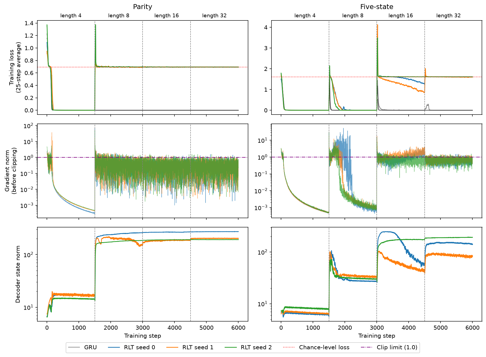
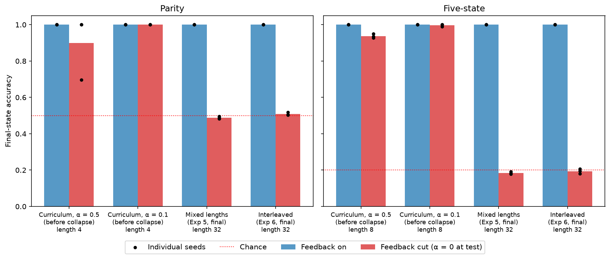

# When Does a Recurrent Looped Transformer Learn to Use Its Feedback?

*An independent implementation and six length-generalization experiments*

**Eric Xu** · October 2026 · Code and full results: this repository

## Abstract

The Recurrent Looped Transformer (RLT) feeds each token's final decoder output back into the next token's decoder input through a gated merge, alongside a causal encoder memory and per-layer sliding-window caches. We implement RLT from its technical report, verify it against the report's formal properties, and study length generalization on two state-tracking tasks with roughly 59K-parameter models trained on programs of up to 32 operations. With per-position supervision, RLT generalizes to 4× its training length, while a parameter-matched transformer and RLT without feedback fall to chance. With final-answer-only supervision, the outcome depends on the length schedule. Under a short-to-long curriculum, a GRU learns both tasks, but RLT collapses to a constant prediction. Checkpoint ablations show that before the collapse, removing RLT's feedback barely changes its accuracy, which supports the explanation that it solved short programs through attention rather than feedback. When long programs appear frequently, mixed into every step or interleaved one length per step, RLT's feedback becomes necessary for its accuracy, and it generalizes perfectly or nearly so on every length evaluated, up to 1,024.

## 1. Introduction

RLT (Zhang, Feng & Qin, 2026) adds a recurrent path to an encoder–decoder transformer. A causal encoder produces token representations and a global key–value memory restricted to the current prefix. A decoder with sliding-window attention reads that memory, and a gated merge feeds the decoder's previous output back into its next input. The number of decoder blocks traversed by the recurrent path grows with sequence length while the number of blocks evaluated per token stays fixed. Per-token cost is not fixed, since cross-attention reads a memory prefix that grows with the sequence.

The recurrent state has two parts: the decoder output `s_t`, fed back through the merge, and the per-layer sliding-window caches. In this report, **feedback** means the first part only. Our ablations remove the feedback and leave the caches and memory intact.

We test whether RLT's recurrence delivers length generalization on state-tracking tasks, and how supervision and the training length schedule affect the solutions it learns.

Our contributions:

- A from-scratch implementation verified against the report's serving-split invariance, full-state causality, and two-gradient-path analysis, with bit-for-bit reproducible training.
- A controlled comparison against RLT with α = 0, a transformer, and a GRU, matched in parameter count (not compute).
- Checkpoint ablations showing that RLT's collapse under a curriculum is preceded by solutions that do not require its feedback.
- Mixed-length and interleaved training that avoid the curriculum collapse and produce models whose accuracy drops to chance when feedback is removed.

## 2. Implementation and verification

The model follows the report's specification: a causal encoder with RoPE at explicit absolute positions; encoder-derived memory restricted to the current prefix; a gated merge, `u_t = e_t + α · g_t ⊙ W_s · RMSNorm(s_{t−1})`; and a decoder applying sliding-window self-attention, cross-attention to memory, and a feed-forward block in that order, with state initialized from a learned `s*`. The decoder runs strictly sequentially, and training uses full backpropagation through time.

Every component was written test-first. The final suite has 392 tests, including:

- **Serving-split invariance (Proposition 3.1).** Prefilling a prompt and then stepping token by token gives identical states and logits at every split point: all 11 splits across 8 configurations, to `1e-12`.
- **Causality (Proposition B.1).** Changing token *j* leaves the full state at every earlier position bit-identical.
- **Two gradient paths.** With window size above 1, gradient reaches `s*` through both the feedback and the window caches. Detaching either alone leaves a gradient; detaching both removes it.
- **Finite differences.** Autograd gradients match central differences to `rtol = 1e-6`.

## 3. Experimental setup

**Tasks.** A program is a sequence of binary operations sampled independently with equal probability, applied to a hidden state that starts at 0; length counts operations, excluding the beginning-of-sequence token. In **parity**, operation 1 flips the state and operation 0 keeps it. In **five-state**, operation 0 swaps states 0 and 1, and operation 1 rotates all five states by one. Order does not matter for parity but does for five-state, whose two operations generate every permutation of five states (the group S5). Chance is 50% for parity and 20% for five-state.

**Table 1.** A worked example: operations `1, 1, 0, 1`, starting from state 0.

| | Op 1 | Op 2 | Op 3 | Op 4 |
| --- | --- | --- | --- | --- |
| Operation | 1 | 1 | 0 | 1 |
| Parity state | 1 | 0 | 0 | 1 |
| Five-state state | 1 | 2 | 2 | 3 |
| Per-position supervision | all four states scored | | | |
| Final-only supervision | | | | last state scored |

The model reads `BOS, 1, 1, 0, 1`; its output after each operation is scored against that operation's state.

**Models.** RLT with width 32, 2 encoder and 2 decoder layers, window 3, one memory group, and α = 0.5 (59,040 parameters on parity). Baselines are matched in parameter count within 5%: RLT with α = 0 (identical, with feedback off), a 3-layer transformer of width 40, and a 1-layer GRU of width 98. **Compute is not matched**: RLT's sequential decoder makes each training step several times slower than the GRU's.

**Training.** AdamW, learning rate 0.003 with 200 warmup steps and cosine decay to 0.0003, weight decay 0.01, gradient clipping at 1.0, batch size 64, fresh programs every step, maximum training length 32, seeds 0, 1, and 2. Runs take 3,000 steps unless noted. Model sizes and optimizer settings were fixed before Experiment 1; later experiments changed supervision, length schedules, duration, or α as described below.

**Objective.** We train on state labels, per-position or final-only, rather than the report's next-token objective, since the next operation is independent of the preceding state. Loss is averaged over supervised positions within each program, then equally over programs.

**Evaluation and selection.** Main evaluations use the same held-out programs for every model: 2,048 per length at 32, 48, 64, 96, and 128. Extended evaluations of the feedback-enabled RLT and GRU conditions in Experiments 1, 5, and 6 use 1,024 per length at 256, 512, and 1,024; the transformer and α = 0 baseline stop at 128. Figure 3's feedback ablations use 512 programs per condition. **Reported accuracies use final checkpoints**, except for the stage checkpoints in Experiment 4. Results above length 32 were not used to tune model or optimizer settings. The experiments were designed adaptively after seeing earlier results.

## 4. Results

### 4.1 With dense labels, RLT's feedback drives generalization (Experiment 1)

**Figure 1.** Final-state accuracy versus program length; the maximum training length is 32 (dashed line). Thick lines are means over 3 seeds; thin lines are individual seeds. On parity, Experiment 1's RLT average (orange) hides a split: two seeds stay at 100% while one falls to chance by length 512. On five-state, the feedback-enabled RLT conditions and the GRU overlap near 100%. The transformer and α = 0 were not evaluated past 128.

With per-position supervision at fixed length 32, RLT reaches 95.6% on parity and 100% on five-state at length 128. RLT with α = 0, the same model with feedback off, falls to chance on parity as soon as programs exceed the training length, and is at chance on five-state even at length 32. The transformer fits parity at length 32 (98.5%) but drops to chance at 48, and never learns five-state, consistent with the expected difficulty of the S5 word problem for fixed-depth transformers. The GRU scores 100% throughout.

The weaker parity seed scores 87.6% at length 128; the other two remain perfect up to 1,024.

### 4.2 Final-answer supervision fails at this budget (Experiment 2)

With only the final state supervised, RLT and the GRU both end at chance on both tasks, even at length 32. A positive control shows that both can learn final-only parity at length 4, reaching 100%. Neither learns at fixed length 32 under this training budget.

In that control, the GRU generalized from length 4 to length 8 at 100%, correct at every intermediate position. RLT reached 74.6% at length 8.

### 4.3 A curriculum works for the GRU, not RLT (Experiment 3)

We trained final-only through four 1,500-step stages at lengths 4, 8, 16, and 32 (6,000 steps). The GRU learned both tasks, reaching 100% at length 128. RLT ended at chance on both.

**Figure 2.** RLT under the final-only curriculum, one line per seed, with the GRU's training loss in gray. Dashed lines mark length transitions. On parity, every seed solves length 4; at step 1,500 the loss jumps to chance and stays there, with a gradient spike and a roughly tenfold rise in decoder state norm. On five-state, all seeds recover from the switch to length 8; at length 16, one seed goes to chance immediately while two make slow partial progress; all reach chance at the switch to length 32. The GRU recovers from every transition.

After the collapse, gradient norms fluctuate mostly between 0.01 and 1 while the loss stays at chance. Five-state's slow partial progress at length 16 suggests that a longer stage might have allowed recovery; we did not test this.

Two observations suggested an attention shortcut. First, length 4 does not require feedback: RLT with α = 0, trained final-only at length 4, reaches 100% there and 48% at length 8. Cross-attention to the encoder memory sees the whole prefix, and with 2 decoder layers and window 3, the window caches alone reach back 4 positions. Second, removing the feedback from the Experiment 2 control model at test time reduced its length-4 accuracy from 100% to 72.3%, so that model used its feedback, but not exclusively.

### 4.4 Before the collapse, the feedback was not needed (Experiment 4)

We reran the curriculum with checkpoints at every stage boundary, at α = 0.5 and at α = 0.1, the authors' feedback scale.

**Reproducibility.** All six α = 0.5 runs reproduce Experiment 3's 6,000-step loss histories bit for bit, despite a different commit, evaluation schedule, and checkpoint code.

**Weaker feedback does not prevent the collapse.** α = 0.1 collapses with the same signature.

**The collapse is a constant answer.** On parity, each collapsed run's accuracy at length 32 equals exactly the share of test programs ending in one class, 50.63% or 49.37%.

**Figure 3.** Feedback ablation. Each model is evaluated as trained (blue) and with its feedback removed at test time by setting α = 0 (red), at the length it was most recently trained on. Bars are means over 3 seeds; dots are individual seeds. Before the curriculum collapse, removing the feedback barely changes accuracy, except for one parity seed at α = 0.5, which drops to 69.7%. In the mixed and interleaved models of Sections 4.5–4.6, removing it drops accuracy to chance. The ablation removes only the feedback path; the window caches and encoder memory remain intact.

In five of six parity runs, removing the feedback at the checkpoint before the collapse changed nothing. On five-state, it reduced accuracy to 92.8–94.9% at α = 0.5 and 99.0–100% at α = 0.1. These solutions did not extend: before any training on longer programs, parity scored 37–67% at length 8, and five-state 20–24% at length 16.

The ablations support an attention-shortcut explanation: before the collapse, most short-program accuracy survives without feedback, but those solutions fail on longer programs. They do not identify which attention path carries the solution or establish why training fails to recover.

Two α values do not rule out feedback or optimization instability. State-norm growth occurs at both values, including in models whose accuracy barely changes without feedback. The feedback is normalized before the merge, so raw state-norm growth alone does not establish the cause of collapse.

### 4.5 A prediction: mixed lengths prevent the collapse (Experiment 5)

The shortcut explanation motivated a prediction: keeping long programs present throughout training should avoid the collapse. We split each batch of 64 into four groups of 16 at lengths 4, 8, 16, and 32, ran each separately, and took one optimizer step on the loss averaged equally over all 64 programs, for 3,000 steps and 192,000 programs.

The prediction held. RLT reached 100% at every length from 32 to 128 on both tasks and every seed, from final answers alone, and stayed at 100% up to length 1,024 except for one five-state seed at 99.9%. Removing its feedback now drops accuracy to chance on every seed (Figure 3): the feedback is necessary for these trained models. This does not show that the memory and window caches contribute nothing.

### 4.6 Control: frequent long programs suffice (Experiment 6)

Mixing changed two things: lengths shared each gradient step, and long programs appeared constantly. We interleaved lengths instead, one length per step, cycling 4, 8, 16, 32, with the same 48,000 programs per length as Experiment 5.

Interleaving also prevents the collapse. RLT reached 100% from 32 to 96 on both tasks and 99.98% on parity at 128, and removing its feedback drops it to chance. At length 1,024, parity seeds score 100%, 98.6%, and 94.0%, against 100% for all three under mixing; five-state seeds score 99.9–100% under both. Within-step mixing therefore is not necessary to prevent the collapse, though it may help slightly at extreme lengths.

This control does not isolate the full cause of the curriculum's failure. The curriculum also differed from Experiments 5 and 6 in duration (6,000 steps versus 3,000) and in the learning rate at which long programs appeared: length 32 arrived only in the final quarter, when the cosine schedule was near its minimum. The first collapse, at step 1,500, happened while the learning rate was still about 0.0027, so the schedule cannot explain its onset, but it may have contributed to the lack of recovery.

**Table 2.** Summary. Final-state accuracy at length 128, mean over 3 seeds, parity / five-state.

| Experiment | Supervision | Training lengths | RLT | GRU |
| --- | --- | --- | --- | --- |
| 1 | Every position | Fixed 32 | 95.6% / 100% | 100% / 100% |
| 2 | Final only | Fixed 32 | 50.1% / 19.7% | 50.0% / 20.1% |
| 3 | Final only | Curriculum 4 → 32 | 49.9% / 19.8% | 100% / 100% |
| 5 | Final only | Mixed 4–32 in every step | 100% / 100% | 100% / 100% |
| 6 | Final only | Interleaved 4–32 | 99.98% / 100% | 100% / 100% |

## 5. Discussion

**RLT's alternatives.** The results are consistent with attention paths offering a short-program solution that need not use hidden-state feedback. Mixed and interleaved training instead yield models that generalize to longer programs and fail when feedback is removed. This contrast supports the shortcut explanation, but does not establish the optimizer's route or exclude other causes of curriculum failure. The GRU has no attention path and succeeds under all three length schedules.

**Relation to the authors' experiments.** The authors' depth-eight results agree with ours where they overlap: their [5+3 and 7+1 splits hold 100% on parity at 256 bits](https://yifanzhang-pro.github.io/recurrent-looped-tranformer/#experiments) while a transformer is near chance. Several of their settings bear on our findings. In their [sixteen-layer runs](https://yifanzhang-pro.github.io/recurrent-looped-tranformer/#depth16), parity training uses mixed lengths 3–40, which by our results should prevent short-length solutions from dominating. They report the checkpoint with the lowest in-distribution validation loss, which would not show a later collapse. They use feedback scale 0.1, which in our setting neither caused nor prevented the collapse. Their models are about 450 times larger than ours.

**The community proof-of-concept.** An [independent community experiment](https://github.com/yifanzhang-pro/recurrent-looped-tranformer#independent-community-experiments) reported RLT at 60.8% on parity and 20.7% on five-state at length 128, well below our Experiment 1. Its training setup is only partly documented, so we cannot identify the cause; supervision, length schedule, and seed variation are all candidates.

**What remains unresolved.**

- *Which attention path carries the short-length solution.* We removed only the feedback. Ablating the window caches (window size 1) or the memory would show whether the solution relies on one, the other, or both.
- *Why five-state recovers once and parity never does.* Five-state recovered at length 8 with a solution that still barely needed its feedback, then failed at 16. Parity failed at the first transition.
- *Whether recovery is possible.* Five-state's slow progress at length 16 suggests a longer stage, an adaptive schedule, or a learning-rate increase at transitions might allow recovery.
- *Mixing versus interleaving at extreme lengths.* The difference at length 1,024 rests on three seeds.
- *Scale.* Whether the same dynamic appears in models the size of the authors' is untested.

**Reporting with few seeds.** Experiment 1's parity average at length 1,024, 83.7%, describes no actual model: two seeds are at 100% and one at chance. With three seeds, per-seed results are essential.

## 6. Limitations

- **Scale and tasks.** About 59K parameters; two synthetic tasks with two operations each.
- **Seeds.** Three per condition. Small differences are leads, not findings.
- **Hyperparameters.** One learning rate and schedule for all models, untuned.
- **Compute.** Matched in parameters, not compute.
- **Ablation interpretation.** Removing feedback at test time also changes the decoder's input distribution, so a drop alone is weak evidence of reliance. The no-change results before the collapse, and their contrast with the mixed and interleaved models, carry the argument.
- **Accuracy is not proof of a rule.** Perfect accuracy on finite test sets up to length 1,024 shows generalization on those lengths, not that the model implements the exact rule.
- **Objective.** State labels rather than the report's next-token objective.

## 7. Reproducibility

Every run's results file records its configuration, commit, and whether the repository was clean, and the comparison script refuses to aggregate runs that differ in commit, settings, or evaluation set. Training is deterministic on one CPU thread. The [README](README.md#reproducing-an-experiment) lists training configurations and commands for extended evaluation, feedback ablation, and all three figures.

## References

Zhang, Y., Feng, J., & Qin, S. (2026). *Recurrent Looped Transformer*. Technical report. [Report](https://yifanzhang-pro.github.io/recurrent-looped-tranformer/Recurrent_Looped_Transformer.pdf) · [Project page](https://yifanzhang-pro.github.io/recurrent-looped-tranformer/) · [Repository](https://github.com/yifanzhang-pro/recurrent-looped-tranformer)
